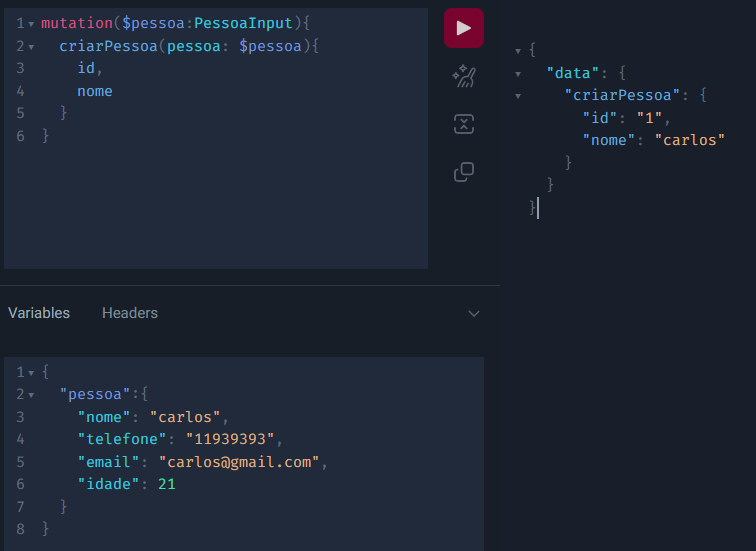
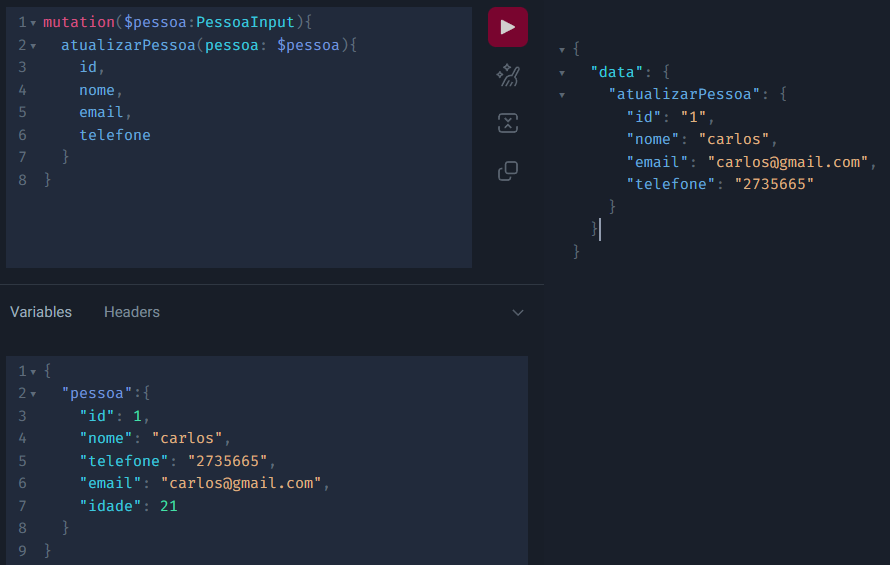
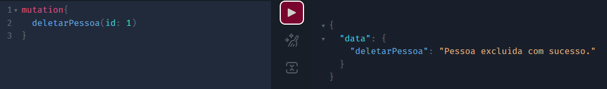
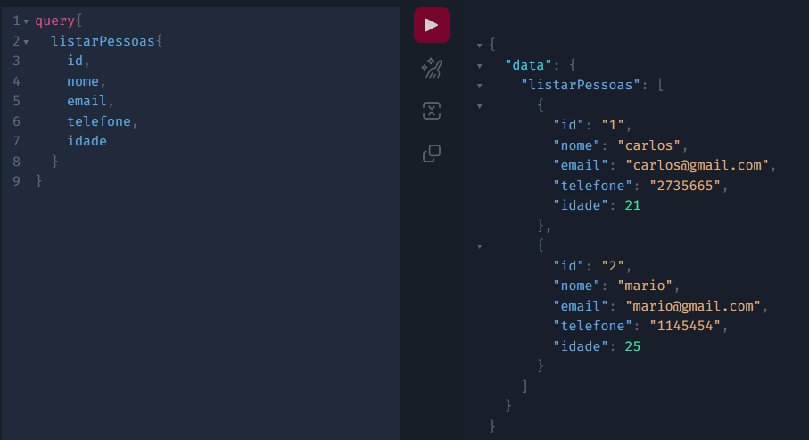
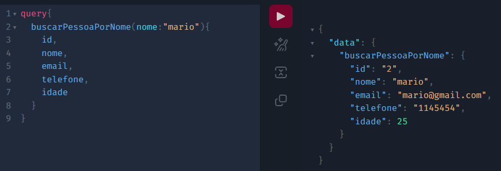
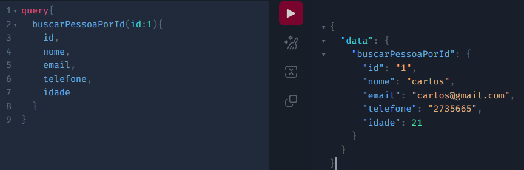

# Microservices com Java e  _Spring Boot_ com graphql

## Introdução

GraphQL é uma linguagem de consulta e ambiente de execução voltada a 
servidores para as interfaces de programação de aplicações (APIs) cuja
prioridade é fornecer exatamente os dados que os clientes solicitam e nada
além. 

O GraphQL foi desenvolvido para tornar as APIs mais rápidas, flexíveis e 
intuitivas para os desenvolvedores. Ainda é possível implantá-lo em um ambiente 
de desenvolvimento integrado (IDE) conhecido como GraphiQL. Como alternativa à 
arquitetura REST, o GraphQL permite aos desenvolvedores construir solicitações
que extraem os dados de várias fontes em uma única chamada de API.

## Sumário

1. [Tecnologias Utilizadas]
2. [ Configuração ]
3. [ Build e Deploy - Ambiente de desenvolvimento (Localhost) ]
4. [ Utilização do Graphql ]
5. [ Referência de Estudos ]

### 1. Tecnologias Utilizadas

- Java (JDK 17)
- Spring Boot (Running with Spring Boot v2.7.5, Spring v5.3.23)
- Graphql
- JPA
- Lombok
- Model Mapper
- H2 Database

### 2. Configuração

#### 2.1 Instale

* [IntelliJ IDEA](https://www.jetbrains.com/pt-br/idea/download/) ou [Spring Tools Suite](https://spring.io/tools)
* [Java JDK 17](https://openjdk.java.net/projects/jdk/17/);
* [Maven](https://maven.apache.org/download.cgi);
* [Git](https://git-scm.com/downloads)

### 3. Build e Deploy - Ambiente de desenvolvimento

#### 3.1 SpringBoot

1. Faça um git clone para o branch desejado;
2. Abra a IDE escolhida (Spring Tool Suite ou IntelliJ)
3. Importe o projeto
4. Realize o build
    1. Aperte o botão com o símbolo de um martelo

    - ou

    2. Digite no terminal mvn package -U
5. Execute o projeto
    1. Aperte o botão com o símbolo de play

    - ou

    2. Digite no terminal mvn exec:java
6. Acessar o projeto
    1. Localhost
        - http://localhost:8080/graphiql?path=/graphql
7. Acessar h2 database
    1. Localhost
        - http://localhost:8080/h2

### 4. Utilização do Graphql

#### 4.1 Mutation

##### 4.1.1 Cadastrar Pessoa

##### 4.1.2 Alterar Pessoa

##### 4.1.3 Excluir Pessoa

#### 4.2 Query

##### 4.2.1 Listar Pessoas

##### 4.2.1 Buscar Pessoa Por Nome

##### 4.2.1 Buscar Pessoa Por ID

### 5. Referencia de Estudos

* [Graphql vs API REST](https://blog.logrocket.com/graphql-vs-rest-api-why-you-shouldnt-use-graphql/#:~:text=GraphQL%20vs.-,REST%3A%20Differences,client%20requests%20data%20with%20queries)
* [Introdução ao GraphQL e Spring Boot](https://www.baeldung.com/spring-graphql)
* [Introdução ao Spring para GraphQL](https://www.graphql-java.com/tutorials/getting-started-with-spring-boot/)
* [Video sobre Graphql com Spring Boot](https://www.youtube.com/watch?v=3PCNqXrU-2g)
